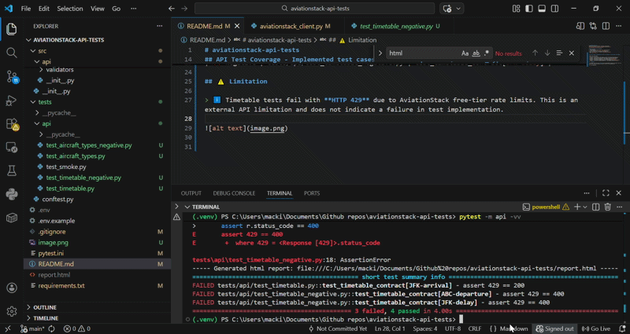

# aviationstack-api-tests
Automated API testing with Python - target API (aviationstack)
[https://aviationstack.com/?utm_source=Github&utm_medium=Referral&utm_campaign=Public-apis-repo-Best-sellers]

## How to run locally
1. Clone repository
2. Create virtualenv (`python -m venv .venv`) and activate venv
3. Install dependencies (`pip install -r requirements.txt`)
4. Get free API key (https://aviationstack.com/signup/free)
5. Copy `.env.example` -> `.env` and set `AVIATIONSTACK_ACCESS_KEY`
6. Run: `pytest -m api -vv`

## API Test Coverage - Implemented test cases for two endpoints: /aircraft_types and /timetable

| Type | File | Test Case |
|------|------|------------|
| ✅ Positive | tests/api/test_aircraft_types.py | test_aircraft_types_returns_data_list |
| ❌ Negative | tests/api/test_aircraft_types_negative.py | test_aircraft_types_negative |
| ✅ Positive | tests/api/test_timetable.py | test_timetable_contract[JFK-departure] |
| ✅ Positive | tests/api/test_timetable.py | test_timetable_contract[JFK-arrival] |
| ❌ Negative | tests/api/test_timetable_negative.py | test_timetable_contract[ABC-departure] |
| ❌ Negative | tests/api/test_timetable_negative.py | test_timetable_contract[JFK-delay] |

## ⚠️ Limitation

> ℹ️ Timetable tests fail with **HTTP 429** due to AviationStack free-tier rate limits. This is an external API limitation and does not indicate a failure in test implementation.

## Validation Used

The tests validate both the HTTP response and the response content.  
Status codes are checked to ensure correct API behavior for positive and negative scenarios.  
Response structure is also validated to confirm that required fields exist and the returned data matches the expected format.  

It helps catch breaking API changes and ensures the responses are usable by clients, not just successful at the HTTP level.

## 🚀 Future/Possible improvements 📈

- 🧪 Introduce response mocking for test_timetable.py and test_timetable_negative, which are related to third-party API license restrictions (429). Since upgrading from a free to a paid license may be costly, mocking would protect tests from flakiness and reduce dependency on external API limitations.
- 📐 Add JSON Schema validation to ensure full API contract verification